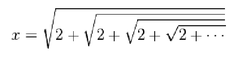
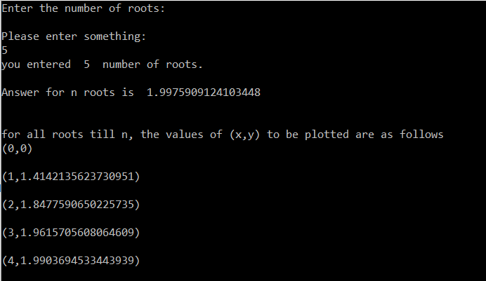

# Graphing with Python

##Learning to graph using Python

### Prompts
#### 1.1 Write a script to calculate the value of x in the following nested square root for different numbers of square roots. Plot the value of x versus the number of square roots. Does it converge to a specific number?

### Answer
#### I found the plotting solution to this problem using recursive function. Also, after analysing the created graph, I found out that it converges to 2 when n tends to infinity.

###Input:

###Output:

#### When n = 5

#### When n = 10

#### When n = 20

#### When n = 100

